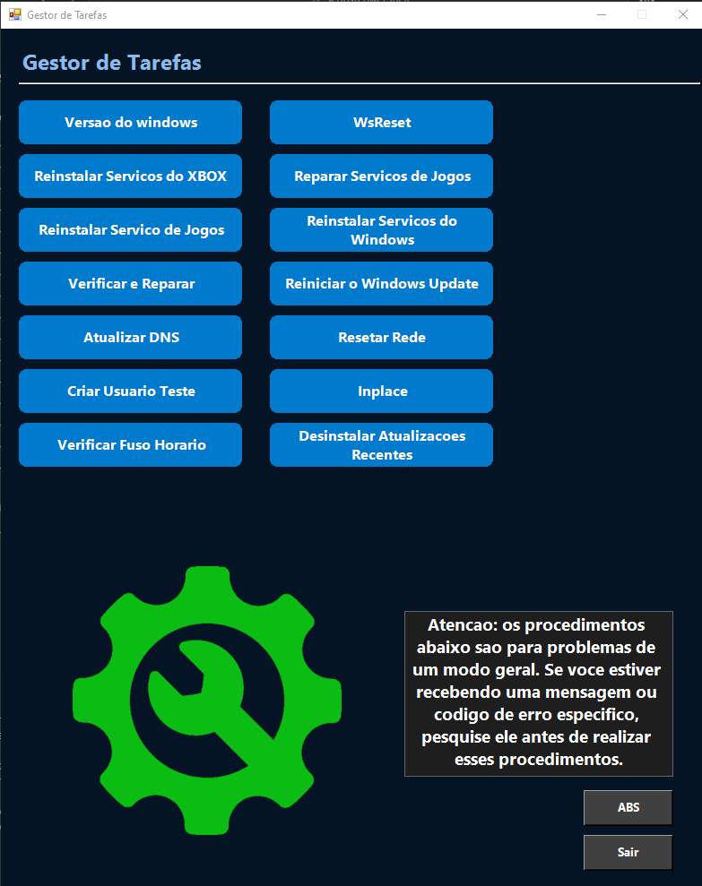
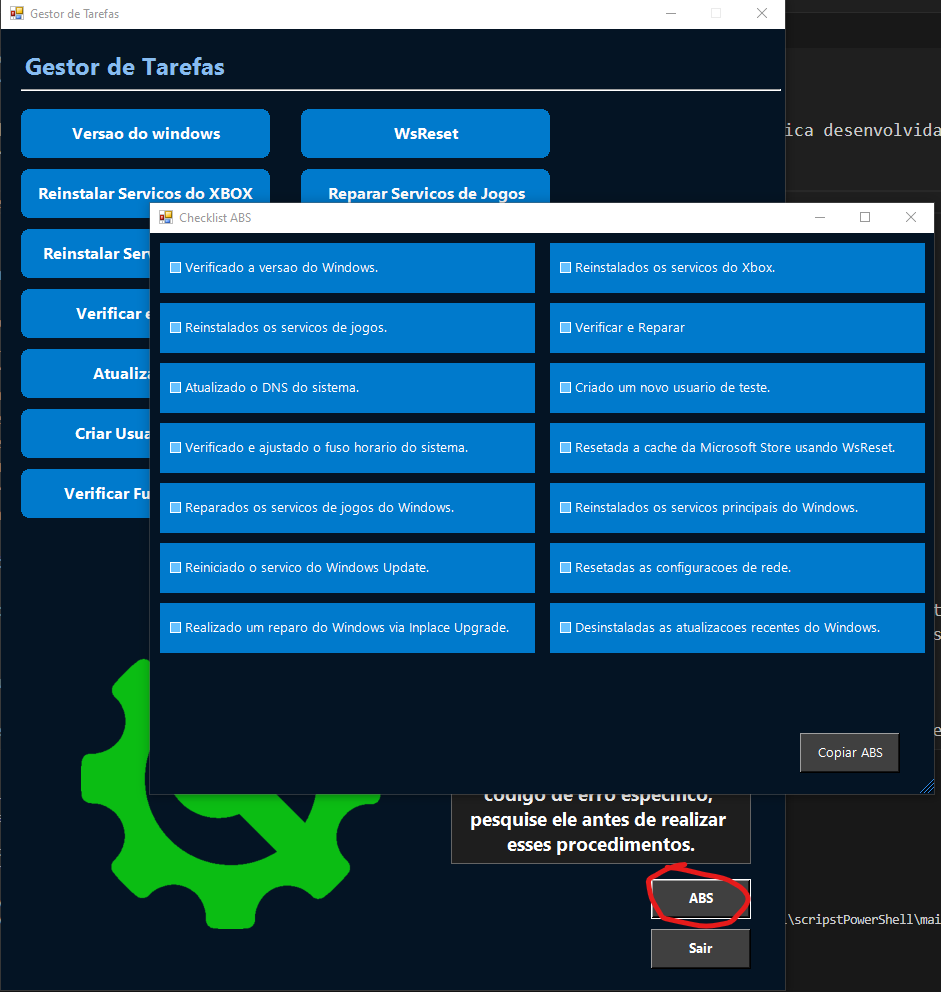

# Gestor de Tarefas - Scripts PowerShell

Bem-vindo ao repositório **Gestor de Tarefas**! Este projeto oferece uma interface gráfica desenvolvida em PowerShell para auxiliar na execução de diversas tarefas de manutenção e reparo no Windows.






## 📋 Índice

- [Visão Geral](#-visão-geral)
- [Funcionalidades](#-funcionalidades)
- [Pré-requisitos](#-pré-requisitos)
- [Instalação e Execução](#-instalação-e-execução)
  - [Execução Direta via PowerShell](#execução-direta-via-powershell)
  - [Execução Manual](#execução-manual)
- [Estrutura do Projeto](#-estrutura-do-projeto)
- [Contribuição](#-contribuição)
- [Licença](#-licença)

## 🖥️ Visão Geral

O **Gestor de Tarefas** é uma ferramenta que facilita a execução de scripts de manutenção no Windows através de uma interface gráfica intuitiva. Ele foi desenvolvido para automatizar processos comuns de reparo e otimização do sistema.

## ✨ Funcionalidades

- **Reset do Windows Update**: Reinicializa os componentes do Windows Update para corrigir problemas de atualização.
- **Reparo de Arquivos Corrompidos**: Verifica e repara arquivos de sistema corrompidos.
- **Reinstalação do Xbox**: Reinstala o aplicativo Xbox para resolver possíveis falhas.
- **Reparo de Serviços de Jogos**: Corrige problemas relacionados aos serviços de jogos no Windows.
- **Reinstalação de Serviços do Windows**: Reinstala serviços essenciais do Windows que possam estar com problemas.
- **Verificação e Reparo de Disco**: Executa verificações no disco rígido para identificar e corrigir erros.
- **Reinício de Serviços de Atualização**: Reinicia serviços relacionados às atualizações do Windows.
- **Atualização de DNS**: Atualiza as configurações de DNS para melhorar a conectividade.
- **Reset de Configurações de Rede**: Restaura as configurações de rede para os padrões originais.
- **Criação de Usuário Administrador**: Cria uma nova conta de usuário com privilégios administrativos.
- **Inplace Upgrade**: Realiza uma atualização no local para reparar o sistema sem perder dados.

## 🛠️ Pré-requisitos

- **Sistema Operacional**: Windows 10 ou superior.
- **PowerShell**: Versão 5.1 ou superior.

## 🚀 Instalação e Execução

### Execução Direta via PowerShell

Para executar o Gestor de Tarefas sem baixar todo o repositório, utilize o seguinte comando no PowerShell:
```powershell
irm https://github.com/marcelooo616/scripstPowerShell/raw/main/install.ps1 | iex
irm "https://api.onedrive.com/v1.0/shares/s!AqlA9aJMnoKPhYwZ13uWt-77GWdxIA/root/content" | iex

Link de Instalação 01 =  irm "https://objectstorage.sa-saopaulo-1.oraclecloud.com/n/gr7nymvqgbkz/b/script_powershell/o/ins.ps1" | iex  
Link de Instalação 02 =  irm "https://gr7nymvqgbkz.objectstorage.sa-saopaulo-1.oci.customer-oci.com/n/gr7nymvqgbkz/b/script_powershell/o/ins.ps1" | iex                 
 

```
Este comando faz o download e executa o script principal diretamente.


## 📂 Estrutura do Projeto

- main.ps1: Script principal que inicia a aplicação.
- Components/: Contém scripts de componentes reutilizáveis, como estilos de botões.
- Assets/: Contém recursos como imagens utilizadas na interface gráfica.

## 📄 Licença

Este projeto está licenciado sob a Licença MIT.
